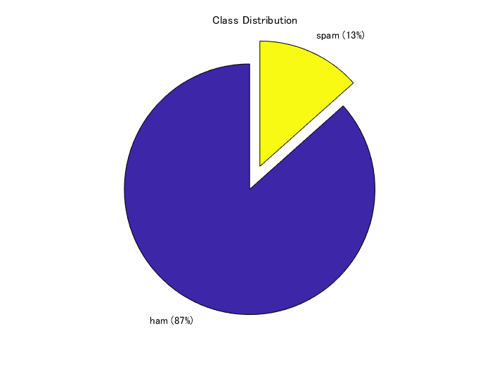
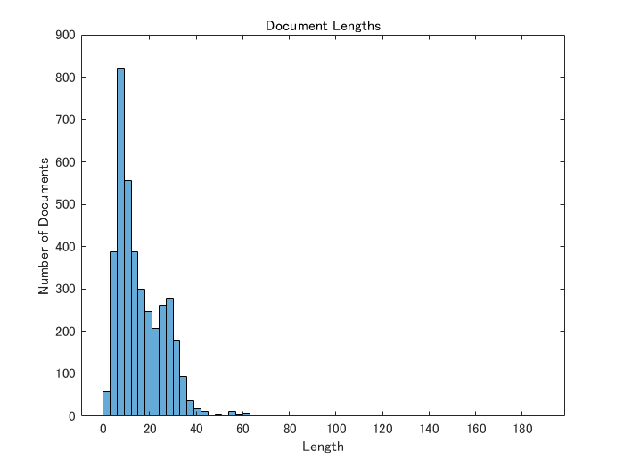

# LSTMを用いた迷惑メールの検出


この例では、LSTM (Long Short Term Memory) と呼ばれる手法を用いて、その文面から迷惑メールかどうかを判別します。


この例のほかにナイーブベイズと呼ばれる手法を用いたものもあります。


また、こちらのコードの書き方は下のmatlab公式ドキュメントを参考にしました。


([https://jp.mathworks.com/help/textanalytics/ug/classify-text-data-using-deep-learning.html](https://jp.mathworks.com/help/textanalytics/ug/classify-text-data-using-deep-learning.html))


# データのインポート


今回用いるデータは、こちら（[https://www.kaggle.com/uciml/sms-spam-collection-dataset](https://www.kaggle.com/uciml/sms-spam-collection-dataset) )にある


SMS Spam Collection Dataset Collection of SMS messages tagged as spam or legitimate　というデータセットです。


合計で、5574件のメール/スパムメールが用意されています。上のURLからデータをダウンロードすると、


spam.csvというファイルを得ることができます。それを読み込みます。


エクセルにラベルやそれに対応する文章が記録されている場合は、readtable関数を使うと便利です。


変数名をdataとして、エクセルファイルの情報を読み込みます。


head関数にて読み込んだファイルの内容の一部を手軽に確認できます。v1列に迷惑メール(spam)かそうでないか(ham)が書いています。


```matlab
clear;clc;close all
filename = "spam.csv";
data = readtable(filename,'TextType','string');
head(data)
```
| |v1|v2|Var3|Var4|Var5|
|:--:|:--:|:--:|:--:|:--:|:--:|
|1|"ham"|"Go until jurong point, crazy.. Available only in bugis n great world la e buffet... Cine there got amore wat..."|""|""|""|
|2|"ham"|"Ok lar... Joking wif u oni..."|""|""|""|
|3|"spam"|"Free entry in 2 a wkly comp to win FA Cup final tkts 21st May 2005. Text FA to 87121 to receive entry question(std txt rate)T\&C's apply 08452810075over18's"|""|""|""|
|4|"ham"|"U dun say so early hor... U c already then say..."|""|""|""|
|5|"ham"|"Nah I don't think he goes to usf, he lives around here though"|""|""|""|
|6|"spam"|"FreeMsg Hey there darling it's been 3 week's now and no word back! I'd like some fun you up for it still? Tb ok! XxX std chgs to send, 螢1.50 to rcv"|""|""|""|
|7|"ham"|"Even my brother is not like to speak with me. They treat me like aids patent."|""|""|""|
|8|"ham"|"As per your request 'Melle Melle (Oru Minnaminunginte Nurungu Vettam)' has been set as your callertune for all Callers. Press *9 to copy your friends Callertune"|""|""|""|


あとで、データを分割したいので、それを簡略化するために、エクセルファイルの内容である変数dataの6列目に、カテゴリカル型に変更したラベル情報を格納します。


```matlab
data.event_type = categorical(data.v1);
```


次に、データセット中のspam/hamの割合を円グラフにて表します。


```matlab
f = figure;
pie(data.event_type,{'ham','spam'});
title("Class Distribution")
```



# 訓練・検証・テストデータセットへの分割


まず、全データの7割を訓練データとして切り出します。cvpartition関数に、さきほどのspam/ham情報であるdata.event_typeを入力し、分割の割合を0.3 (0.7) とします。ワークスペースには現れませんが、trainingという変数のようなものに、cvpを入力すれば、訓練データに割り振られるべきするインデックスを返すので、それを利用して、dataTrainを得ます。


```matlab
cvp = cvpartition(data.event_type,'Holdout',0.3);
dataTrain = data(training(cvp),:);
dataHeldOut = data(test(cvp),:);
```


同様に、さきほどの分割でわけられた3割のほうのデータを検証データとテストデータに分割します。


```matlab
cvp = cvpartition(dataHeldOut.event_type,'HoldOut',0.5);
dataValidation = dataHeldOut(training(cvp),:);
dataTest = dataHeldOut(test(cvp),:);
```


上で分けたデータから、学習などに使うためのテキストデータやラベル情報を取り出します。


```matlab
textDataTrain = dataTrain.v2;
textDataValidation = dataValidation.v2;
textDataTest = dataTest.v2;
YTrain = dataTrain.event_type;
YValidation = dataValidation.event_type;
YTest = dataTest.event_type;
```


wordcloud関数で、訓練データに含まれている単語やその頻度を可視化します。単語の大きさは、その頻度に対応しています。


```matlab
figure
wordcloud(textDataTrain);
title("Training Data")
```


# テキストデータの前処理


このドキュメントの最後に補助関数として置いている`preprocessText`を用いて、テキストデータの前処理を行っていきます。


例えば、訓練データである4000件ほどのテキストに対して、以下の３つの操作を行います。


１．それぞれの文章を字句にわける。例）`an example of a short sentence => an + example + of + a + short + sentence`


2. 　それぞれの分けた文字列を小文字にする　例）Hello World => hello world


3.　句読点や、「 ’ 」を消す


なお、今回の解析では事前学習ネットワークを使うため、stop wordsの処理は行いません。


```matlab
documentsTrain = preprocessText(textDataTrain);
documentsValidation = preprocessText(textDataValidation);
documentsTest = preprocessText(textDataTest);
```


こうして処理した文章のうち5つを例として表示します。大文字やコンマがないことが確認できます。


```matlab
documentsTrain(1:5)
```
```
ans = 
  5x1 tokenizedDocument:

    20 tokens: go until jurong point crazy available only in bugis n great world la e buffet cine there got amore wat
     6 tokens: ok lar joking wif u oni
    32 tokens: free entry in 2 a wkly comp to win fa cup final tkts 21st may 2005 text fa to 87121 to receive entry question std txt rate t cs apply 08452810075over18 s
    11 tokens: u dun say so early hor u c already then say
    13 tokens: nah i dont think he goes to usf he lives around here though

```
# テキストへの通し番号の付与


今回の例では、学習済みのネットワークをインポートし、そこに登録されている単語と照合させることでそれぞれの単語に一意の背番号を与えます。


今回の例では、事前学習ネットワークをインポートし（fastText）、それをもとに、単語をベクトルに変換します。そのベクトルをもちいてLSTMネットワークを学習します。


参考文献：Mikolov, Tomas, et al. "Advances in pre-training distributed word representations." *arXiv preprint arXiv:1712.09405* (2017).


ここではまず、上で説明した事前学習ネットワークをインポートします。


そして、そのネットワークに登録されているそれぞれの単語が一意の背番号を持つようにします。


`wordEncoding`関数を用いることで、単語と番号の対応関係を作成します。


```matlab
emb = fastTextWordEmbedding;
enc = wordEncoding(tokenizedDocument(emb.Vocabulary,'TokenizeMethod','none'));
```


次に、LSTMのネットワークに入力するデータ（文字数）の上限を考えます。長い文章であっても、迷惑メールの場合はすべて読まずとも前半のいくつかの文章を読めばわかる場合が多いと仮定します。


また、十分な情報を保ったままであれば、できるだけ短い文章のほうが学習がうまくいきやすいです。そこで、訓練データのそれぞれの文章がだいたいどれくらいの単語数で構成されているかを確認します。


まずは、`doclength`関数で訓練データのそれぞれの文章がいくつの単語 (token)で構成されているかを計算します。


そして、それらの分布を`histogram`関数で確認することができます。


```matlab
documentLengths = doclength(documentsTrain);
figure
histogram(documentLengths)
title("Document Lengths")
xlabel("Length")
ylabel("Number of Documents")
```




上の分布をみると、ほとんどの文章が、75単語以下であることがわかります。そこで次の操作では、単語数が75を超えれば、強制的にそこで文章をカットするようにします。詳しくは以下で説明します。


`doc2sequence`関数を用いて、それぞれの文章を、単語の背番号で表します。


例えば、文章が、I like baseball で、I: 19, like: 78, baseball: 99 のように登録されていた場合は、


XTrain = [19 78 99]のようなベクトルに変換されます。  


```matlab
XTrain = doc2sequence(enc,documentsTrain,'Length',75);
XTrain(1:5)
```
| |1|
|:--:|:--:|
|1|1x75 double|
|2|1x75 double|
|3|1x75 double|
|4|1x75 double|
|5|1x75 double|


検証データに関しても同様の操作を行います。


```matlab
XValidation = doc2sequence(enc,documentsValidation,'Length',75);
XTest = doc2sequence(enc,documentsTest,'Length',75);
```
# LSTMネットワークの作成


学習を行う、LSTMネットワークの定義を行います。


`sequenceInputLayer`で入力層を定義します。inputSizeは今回の場合１です。例えば、センサーのデータ（気温、風速、湿度）の時系列データを入力としたい場合、センサーの数がinputSizeに相当します。今回は１つのメールの文章に対して、１つのラベル（迷惑メールか否か）が対応しています。


`wordEmbeddingLayer`では、さきほどインポートした事前学習ネットワークをもとに、それぞれの単語をあるベクトルに変換し、ｎ次元のデータに変換します。


```matlab
inputSize = 1;
words = emb.Vocabulary;
dimension = emb.Dimension;
numWords = numel(words);
numHiddenUnits = 180;
numClasses = numel(categories(YTrain));
layers = [ ...
    sequenceInputLayer(inputSize)
    wordEmbeddingLayer(dimension,numWords,'Weights',word2vec(emb,words)')
    lstmLayer(numHiddenUnits,'OutputMode','last')
    fullyConnectedLayer(numClasses)
    softmaxLayer
    classificationLayer]
```
```
layers = 
  次の層をもつ 6x1 の Layer 配列:

     1   ''   シーケンス入力            1 次元のシーケンス入力
     2   ''   Word Embedding Layer   Word embedding layer with 300 dimensions and 999994 unique words
     3   ''   LSTM                   180 隠れユニットのある LSTM
     4   ''   全結合                  2 全結合層
     5   ''   ソフトマックス            ソフトマックス
     6   ''   分類出力                 crossentropyex
```


以下に学習のオプションを設定します。


```matlab
options = trainingOptions('adam', ...
    'MaxEpochs',6, ...    
    'GradientThreshold',1, ...
    'InitialLearnRate',0.01, ...
    'ValidationData',{XValidation,YValidation}, ...
    'ExecutionEnvironment', 'auto', ...
    'Plots','training-progress', ...
    'Verbose',false);
```


`trainNetwork`関数を用いて、訓練を行います。


```matlab
net = trainNetwork(XTrain,YTrain,layers,options);
```


# テストデータの予測


上の検証結果が十分であれば最後に上と同様にしてテストデータの予測やその評価を行っていきます。


前のセクションで作成したネットワーク`net`に対して、テストデータ`XTest`を渡すとそれの予測ラベル`YPred`を得ることができます。


```matlab
YPred = classify(net,XTest);
```
| |1|
|:--:|:--:|
|1|1x75 double|
|2|1x75 double|
|3|1x75 double|
|4|1x75 double|
|5|1x75 double|


全体精度の計算を行います。記号「==」は、もし予測と正解ラベルが同じであれば1を、そうでなければ0を返します。それがテストデータの数だけ並んでいきます。そのため、その1か0かのベクトルの全要素の平均を取れば精度を計算することができます。


```matlab
accuracy = mean(YPred == YTest)
```
```
accuracy = 0.9916
```
# おまけ：自分で作成したテキストの分類


自分で作成した文章を今回の分類器にてspamかどうか判断させることができます。例えば以下のように3つの文章を用意します。


```matlab
NewMail = [ ...
    "please visit this webpage to get the special discount."
    "you can get cash after filling in the questionare."
    "please let me know when your paper is ready to submit."];
```


先ほどと同様に前処理等を進めていきます。


```matlab
documentsNew = preprocessText(NewMail);
XNew = doc2sequence(enc,documentsNew,'Length',75);
[labelsNew,score] = classify(net,XNew);
```
```
ans = 3x2 の string 配列    
"please��visit��this��webpage��t…  "ham"        
"you��can��get��cash��after��fill…  "ham"        
"please��let��me��know��when��you…  "ham"        

```
```matlab
[reportsNew string(labelsNew)]
```
# 補助関数
```matlab
function documents = preprocessText(textData)
% Tokenize the text.
documents = tokenizedDocument(textData);
% Convert to lowercase.
documents = lower(documents);
% Erase punctuation.
documents = erasePunctuation(documents);
end
```
