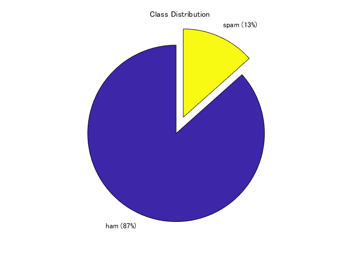
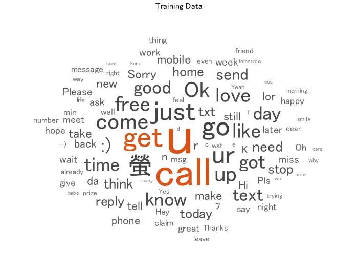
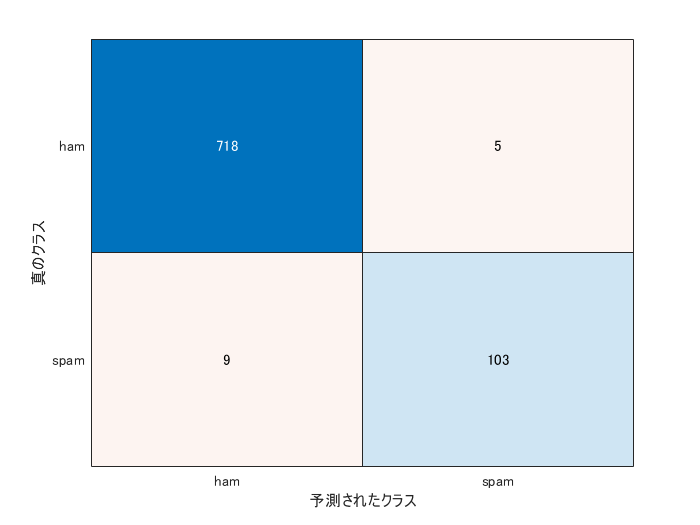

# ナイーブベイズを用いた迷惑メールの検出


この例では、ナイーブベイズと呼ばれる手法を用いて、その文面から迷惑メールかどうかを判別します。


この例のほかにLSTM(long short term memory)と呼ばれる手法を用いたものもあります。


こちらのナイーブベイズを用いた方法に関してはこちらの記事を参考にさせていただきました。


機械学習 �� 迷惑メール分類（ナイーブベイズ分類器） ��　[https://qiita.com/fujin/items/50fe0e0227ef8457a473](https://qiita.com/fujin/items/50fe0e0227ef8457a473)


また、こちらのコードの書き方は下のmatlab公式ドキュメントを参考にしました。


([https://jp.mathworks.com/help/textanalytics/ug/classify-text-data-using-deep-learning.html](https://jp.mathworks.com/help/textanalytics/ug/classify-text-data-using-deep-learning.html))


# データのインポート


今回用いるデータは、こちら（[https://www.kaggle.com/uciml/sms-spam-collection-dataset](https://www.kaggle.com/uciml/sms-spam-collection-dataset) )にある


SMS Spam Collection Dataset Collection of SMS messages tagged as spam or legitimate　というデータセットです。


合計で、5574件のメール/スパムメールが用意されています。上のURLからデータをダウンロードすると、


spam.csvというファイルを得ることができます。それを読み込みます。


エクセルにラベルやそれに対応する文章が記録されている場合は、readtable関数を使うと便利です。


変数名をdataとして、エクセルファイルの情報を読み込みます。


head関数にて読み込んだファイルの内容の一部を手軽に確認できます。v1列に迷惑メール(spam)かそうでないか(ham)が書いています。


```matlab
clear;clc;close all
rng('default')
filename = "spam.csv";
data = readtable(filename,'TextType','string');
head(data)
```
| |v1|v2|Var3|Var4|Var5|
|:--:|:--:|:--:|:--:|:--:|:--:|
|1|"ham"|"Go until jurong point, crazy.. Available only in bugis n great world la e buffet... Cine there got amore wat..."|""|""|""|
|2|"ham"|"Ok lar... Joking wif u oni..."|""|""|""|
|3|"spam"|"Free entry in 2 a wkly comp to win FA Cup final tkts 21st May 2005. Text FA to 87121 to receive entry question(std txt rate)T\&C's apply 08452810075over18's"|""|""|""|
|4|"ham"|"U dun say so early hor... U c already then say..."|""|""|""|
|5|"ham"|"Nah I don't think he goes to usf, he lives around here though"|""|""|""|
|6|"spam"|"FreeMsg Hey there darling it's been 3 week's now and no word back! I'd like some fun you up for it still? Tb ok! XxX std chgs to send, 螢1.50 to rcv"|""|""|""|
|7|"ham"|"Even my brother is not like to speak with me. They treat me like aids patent."|""|""|""|
|8|"ham"|"As per your request 'Melle Melle (Oru Minnaminunginte Nurungu Vettam)' has been set as your callertune for all Callers. Press *9 to copy your friends Callertune"|""|""|""|


あとで、データを分割したいので、それを簡略化するために、エクセルファイルの内容である変数dataの6列目に、カテゴリカル型に変更したラベル情報を格納します。


```matlab
data.event_type = categorical(data.v1);
```


次に、データセット中のspam/hamの割合を円グラフにて表します。


```matlab
f = figure;
pie(data.event_type,{'ham','spam'});
title("Class Distribution")
```



# 訓練・検証・テストデータセットへの分割


まず、全データの7割を訓練データとして切り出します。cvpartition関数に、さきほどのspam/ham情報であるdata.event_typeを入力し、分割の割合を0.3 (0.7) とします。ワークスペースには現れませんが、trainingという変数のようなものに、cvpを入力すれば、訓練データに割り振られるべきするインデックスを返すので、それを利用して、dataTrainを得ます。


```matlab
cvp = cvpartition(data.event_type,'Holdout',0.3);
dataTrain = data(training(cvp),:);
dataHeldOut = data(test(cvp),:);
```


同様に、さきほどの分割でわけられた3割のほうのデータを検証データとテストデータに分割します。


```matlab
cvp = cvpartition(dataHeldOut.event_type,'HoldOut',0.5);
dataValidation = dataHeldOut(training(cvp),:);
dataTest = dataHeldOut(test(cvp),:);
```


上で分けたデータから、学習などに使うためのテキストデータやラベル情報を取り出します。


```matlab
textDataTrain = dataTrain.v2;
textDataValidation = dataValidation.v2;
textDataTest = dataTest.v2;
YTrain = dataTrain.event_type;
YValidation = dataValidation.event_type;
YTest = dataTest.event_type;
```


wordcloud関数で、訓練データに含まれている単語やその頻度を可視化します。単語の大きさは、その頻度に対応しています。


```matlab
figure
wordcloud(textDataTrain)
```
```
ans = 
  WordCloudChart のプロパティ:

           WordData: [1x5747 string]
           SizeData: [1x5747 double]
    MaxDisplayWords: 100

  すべてのプロパティ を表示

```
```matlab
title("Training Data")
```



# テキストデータの前処理


このドキュメントの最後に補助関数として置いている`preprocessText`を用いて、テキストデータの前処理を行っていきます。


例えば、訓練データである4000件ほどのテキストに対して、以下の３つの操作を行います。


１．それぞれの文章を字句にわける。例）`an example of a short sentence => an + example + of + a + short + sentence`


2. 　それぞれの分けた文字列を小文字にする　例）Hello World => hello world


3.　句読点や、「 ’ 」を消す


```matlab
documentsTrain = preprocessText(textDataTrain);
documentsValidation = preprocessText(textDataValidation);
documentsTest = preprocessText(textDataTest);
```


こうして処理した文章のうち5つを例として表示します。大文字やコンマがないことが確認できます。


```matlab
documentsTrain(1:5)
```
```
ans = 
  5x1 tokenizedDocument:

     6 tokens: ok lar joking wif u oni
    32 tokens: free entry in 2 a wkly comp to win fa cup final tkts 21st may 2005 text fa to 87121 to receive entry question std txt rate t cs apply 08452810075over18 s
    11 tokens: u dun say so early hor u c already then say
    13 tokens: nah i dont think he goes to usf he lives around here though
    33 tokens: freemsg hey there darling its been 3 weeks now and no word back id like some fun you up for it still tb ok xxx std chgs to send 螢 150 to rcv

```


今回のように頻度をベースに分類を行う場合、Iやtoなどの一般的に広く使われる単語の頻度はあまり分類に寄与しないと考えられます。そこで、以下のsequence2freq関数で処理する際に、よく見られる単語はカウントしないように制御します(stop word)。


stopWordsという名前であらかじめ削除すべき単語が用意されていて、removeWords関数と併用することでそれぞれのテキストからstop wordsを削除することができます。


([https://jp.mathworks.com/help/textanalytics/ref/stopwords.html](https://jp.mathworks.com/help/textanalytics/ref/stopwords.html))


```matlab
documentsTrain = removeWords(documentsTrain,stopWords);
documentsValidation = removeWords(documentsValidation,stopWords);
documentsTest = removeWords(documentsTest,stopWords);
documentsTrain(1:5)
```
```
ans = 
  5x1 tokenizedDocument:

     6 tokens: ok lar joking wif u oni
    26 tokens: free entry 2 wkly comp win fa cup final tkts 21st 2005 text fa 87121 receive entry question std txt rate t cs apply 08452810075over18 s
     9 tokens: u dun say early hor u c already say
     7 tokens: nah think goes usf lives around though
    21 tokens: freemsg hey darling 3 weeks word back id like fun up still tb ok xxx std chgs send 螢 150 rcv

```
# テキストの出現頻度の計算


今回の例では、訓練データで観測された全単語を調査し、それぞれの単語に一意の背番号を与えます。


`wordEncoding`関数に対して、訓練データを入力として与えます。


また、`'Order',"frequency"`とすれば登録する単語の順番を、訓練データで観測された頻度の順番になります。


```matlab
enc = wordEncoding(documentsTrain,'Order',"frequency",'MaxNumWords',6000);
```


次に、`doc2sequence`関数を用いて、それぞれの文章を、単語の背番号で表します。


例えば、文章が、I like baseball で、I: 19, like: 78, baseball: 99 のように登録されていた場合は、


XTrain = [19 78 99]のようなベクトルに変換されます。  


```matlab
XTrain = doc2sequence(enc,documentsTrain,'PaddingDirection','none');
```


変換後の`XTrain`の一部を表示します。数字の羅列で表現されていることがわかります。


```matlab
XTrain{3001:3003}
```
```
ans = 1x7    
         191         559         276          15         144        1686         798

ans = 1x18    
         291          15         267         421         186         258         591         363         734         103         199        1499          71         255          36         734         186          71

ans = 1x11    
           4        1573         126        1146        1802          86         336          47         448           4        2403

```


さきほど、wordEncoding関数を使った際に、頻度の順番で単語を登録するように設定しました。


ind2word関数を用いて、変数encに登録されている単語の順番（インデックス）から、どの単語が登録されているかを参照することができます。たとえば、以下の操作で最も多く観測された単語上位20個を見ることができます。なお、stop wordsは削除されているので、それらは表示されません。


```matlab
idx = [1:20];
words = ind2word(enc,idx)
```
```
words = 1x20 の string 配列    
"u"          "call"       "2"          "just"       "get"        "ur"         "螢"          "gt"         "lt"         "up"         "4"          "ok"         "free"       "go"         "got"        "like"       ":)"         "good"       "come"       "know"       

```


次に、このドキュメントの最後にある補助関数sequence2freqを用いて、それぞれの文章に、どの単語が何回出現したかを集計します。


例えば、文章が単語の背番号を用いて、[3 1 2 2 5 3]という文章で表されていたら、それぞれの単語の頻度は以下のようになります。


[1 2 2 0 1 0 0 0 ...]


ここで、訓練データで観測された単語に対して調べられるので、5以降の単語に対しても頻度の計算が行われます（頻度0が返されます）。訓練データで観測された総単語数に対して、それぞれの文章は小さいので、こちらの頻度のデータは、0が非常に多くなります。


```matlab
XTrainFreq=sequence2freq(XTrain,enc);
```


同様に検証データ・テストデータも処理を行います。


```matlab
XValidation = doc2sequence(enc,documentsValidation,'PaddingDirection','none');
XValidationFreq=sequence2freq(XValidation,enc);
XTest = doc2sequence(enc,documentsTest,'PaddingDirection','none');
XTestFreq=sequence2freq(XTest,enc);
```


以上の操作で、訓練・検証・テストデータのそれぞれの文章について、どの単語がどれくらいの頻度で出現するかを集計することができました。頻度という特徴と迷惑メールかどうかというラベルをもとに、訓練や検証を行っていきます。


# 訓練データに対する、ナイーブベイズの実行


`fitcnb`関数でナイーブベイズを用いた訓練を行うことができます。今回の訓練データは上述したように0の多いものとなっています。そのため、分布を多項分布を仮定します。`'DistributionNames','mn'`として宣言することができます。また、事前分布は訓練データのspam/hamの割合を採用します。`'Prior','empirical'`と宣言すればよいです。


```matlab
Mdl = fitcnb(XTrainFreq,YTrain,'DistributionNames','mn','Prior','empirical');
```


predict関数に、上で作成したモデルと、検証データを入力することで、検証データの予測を行うことができます。


```matlab
Ypred_Validation=predict(Mdl,XValidationFreq);
```


混合行列を作成し、予測内容の分布を確認します。


```matlab
confusionchart(YValidation,Ypred_Validation)
```


```
ans = 
  ConfusionMatrixChart のプロパティ:

    NormalizedValues: [2x2 double]
         ClassLabels: [2x1 categorical]

  すべてのプロパティ を表示

```
# テストデータの予測


上の検証結果が十分であれば最後に上と同様にしてテストデータの予測やその評価を行っていきます。


```matlab
[YPred_Test,Posterior,Cost]=predict(Mdl,XTestFreq);
confusionchart(YTest,YPred_Test)
```



```
ans = 
  ConfusionMatrixChart のプロパティ:

    NormalizedValues: [2x2 double]
         ClassLabels: [2x1 categorical]

  すべてのプロパティ を表示

```
```matlab
Mdl.Prior
```
```
ans = 1x2    
    0.8659    0.1341

```
```matlab
accuracy = mean(YTest==YPred_Test)
```
```
accuracy = 0.9832
```


98％ 以上の高い精度で、迷惑メールかどうかを判別することができました。今回の例では、それぞれの単語の頻度をもとに分類を行っていて、単語同士の関連や順番などは考慮していません。もう１つの例である、LSTMを用いた分類では、単語をベクトルに変換し、時系列的に扱っています。よろしければそちらもご参照ください。


# おまけ：自分で作成したテキストの分類


自分で作成した文章を今回の分類器にてspamかどうか判断させることができます。例えば以下のように3つの文章を用意します。


```matlab
reportsNew = [ ...
    "please visit this webpage to get the special discount."
    "you can subscribe this online journal for free for one year"
    "please let me know when your paper is ready to submit."];
```


先ほどと同様に前処理等を進めていきます。


```matlab
documentsNew = preprocessText(reportsNew);
XNew = doc2sequence(enc,documentsNew,'PaddingDirection','none');
XNewFreq=sequence2freq(XNew,enc);
```


`predict`関数に入力します。


```matlab
[YPred_New,PosteriorNew,CostNew]=predict(Mdl,XNewFreq)
```
```
YPred_New = 3x1 の categorical 配列    
spam         
ham          
ham          

PosteriorNew = 3x2    
    0.3643    0.6357
    0.6941    0.3059
    0.9998    0.0002

CostNew = 3x2    
    0.6357    0.3643
    0.3059    0.6941
    0.0002    0.9998

```


上から順に、spam, spam, hamと判断されていることがわかります。


# 補助関数
```matlab
function documents = preprocessText(textData)

% Tokenize the text.
documents = tokenizedDocument(textData);

% Convert to lowercase.
documents = lower(documents);

% Erase punctuation.
documents = erasePunctuation(documents);

end

function freq=sequence2freq(sequence,enc)
numWords=enc.NumWords;
freq=zeros(numel(sequence),numWords-1);
edges = (1:numWords);
    for i=1:numel(sequence)
        freq(i,:)=histcounts(sequence{i},edges);    
    end
end
```
