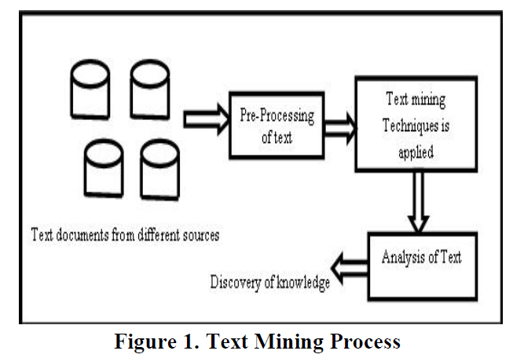
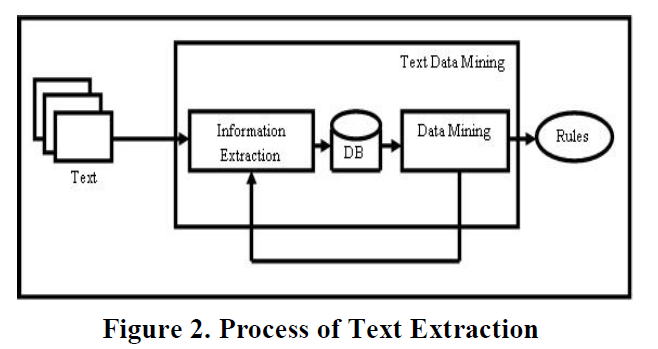
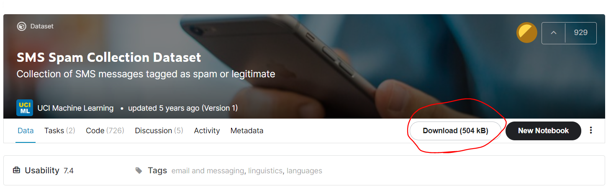
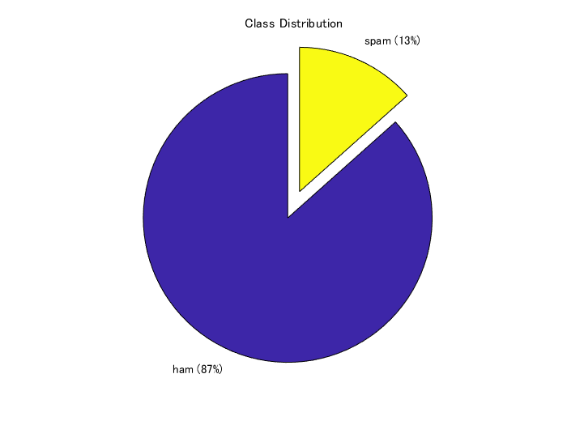
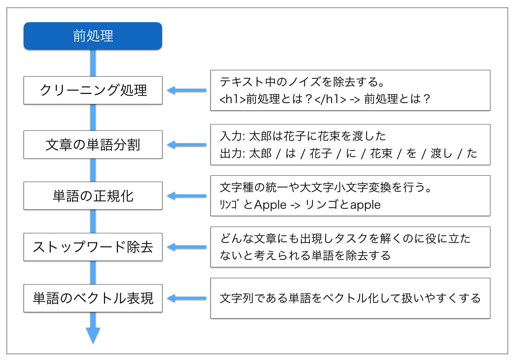
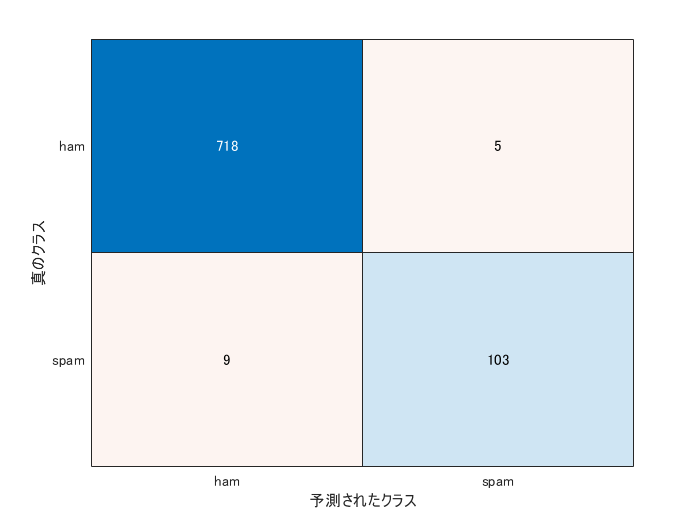

# ナイーブベイズを用いた迷惑メールの検出

この例では、ナイーブベイズやLSTMと呼ばれる手法を用いて、その文面から迷惑メールかどうかを判別します。前半では、メール本文の各単語の出現頻度とナイーブベイズを用いて、迷惑メールの分類を行います。後半では、事前学習ネットワークを用いて単語をベクトル表現に変換し、それをもとに深層学習（LSTM)をもちいて分類します。
前半のナイーブベイズを用いた方法に関してはこちらの記事を参考にさせていただきました。

# 注意

筆者はこの分野の全くの素人で、あくまで「入門してみた」という記事になります。間違いなどがあれば、教えていただけますと幸いです。

こちらの記事で用いたコードはこちらにアップデートしています。何かの役に立てば嬉しいです。

https://github.com/KentaItakura/spam-mail-classification-using-machine-learning-with-matlab-in-Japanese-

この例のほかにLSTM(long short term memory)と呼ばれる手法を用いたものもアップロードしてあります。

# 入門するにあたって勉強させていただいたWEBページ

これらの記事を参考にさせていただきました。

   -  機械学習 〜 迷惑メール分類（ナイーブベイズ分類器） 〜　 

[https://qiita.com/fujin/items/50fe0e0227ef8457a473](https://qiita.com/fujin/items/50fe0e0227ef8457a473)

   -  自然言語処理（NLP）とは | 仕組み・活用例・今後の課題 

https://ledge.ai/nlp/

   -  また、こちらのコードの書き方は下のmatlab公式ドキュメントを参考にしました。 

[https://jp.mathworks.com/help/textanalytics/ug/classify-text-data-using-deep-learning.html](https://jp.mathworks.com/help/textanalytics/ug/classify-text-data-using-deep-learning.html)

# 入門するにあたって読んだ論文

初学者でも読める論文がないか探してみると以下のものが見つかりました [1]。2021年12月12日時点で、引用数は450で、たくさん引用されてるようですし、私も一部読んでみることにしました。

[Vijayarani, S., Ilamathi, M.J. and Nithya, M., 2015. Preprocessing techniques for text mining-an overview. International Journal of Computer Science \& Communication Networks, 5(1), pp.7-16.](https://www.researchgate.net/publication/339529230_Preprocessing_Techniques_for_Text_Mining_-_An_Overview)

## イントロダクションの和訳

以下に、**私の勝手な解釈に基づいた**論文のイントロダクションの和訳を掲載します。意訳なども含むのでご注意ください。

========================================================

　テキストマイニングとは、テキストデータから有用な情報を探したり、抽出したりするプロセスです。構造化されていない（決まったフォーマットや方式で保存されておらず、意味の理解の仕方が明らかでない、という意味に近い？）テキストから知識を発見しようとするもので、挑戦的な研究分野です。テキストマイニングは、テキストデータマイニング(Text Data Mining: TDM)やテキストデータベースにおける知識発見(Knowledge Discovery in Textual Databases: KDT)とも呼ばれています。KDTは、テキスト理解のような新しいアプリケーションにおいて、ますます重要な役割を果たしています。テキストマイニングのプロセスはデータマイニングと同じですが、データマイニングのための方法は構造化されたデータを扱うように設計されているのに対し、テキストマイニングは電子メールやHTMLファイル、フルテキスト文書などの構造化されていない、または半構造化データセットを扱うことができます。[1]. テキストマイニングは、さまざまな文書リソースから、これまで認識されていなかった新しい情報を見つけるために使用されます。

　構造化データとは、その記録やファイル内にある固定された領域に存在するデータのことです。このデータは、[関係データベース](https://ja.wikipedia.org/wiki/%E9%96%A2%E4%BF%82%E3%83%87%E3%83%BC%E3%82%BF%E3%83%99%E3%83%BC%E3%82%B9)やスプレッドシートに含まれています。非構造化データとは、通常、伝統的な行および列からなるデータベースに存在しない情報を指し、構造化データとは正反対のものです。半構造化データとは、生データでもなければ、従来のデータベースシステムに入力されたデータでもないデータのことです。テキストマイニングは、データマイニング、機械学習、情報抽出、自然言語処理、情報検索、知識管理、分類などの分野で発生する問題を解決しようとする、コンピュータサイエンスの新しい研究分野です。図1は、テキストマイニングプロセスの概要を示したものです。



図出展：Vijayarani, S et al. (2015)の図１より

　本稿の２章以降は、以下のように構成されています。セクション2では、文献レビューを行います。セクション3では、テキストマイニングのための前処理方法を説明します。セクション4では、分類のためのステミングアルゴリズムについて述べます。結論はセクション5で述べます。

1.1 Applications of Text Mining

**情報検索**

　情報検索（IR）の概念は、長年にわたってデータベースシステムとの関連で発展してきました。情報検索とは、テキストベースの多数の文書から情報を関連付けて検索することです。情報検索システムとデータベースシステムは、それぞれ様々な種類のデータを扱います。データベースシステムの問題の中には、同時実行制御、リカバリ、トランザクション管理、更新など、情報検索システムには通常存在しないものがあります。また、非構造化文書、キーワードに基づく推定検索、関連性の概念など、通常のデータベースシステムにはない一般的な情報検索の問題もあります。膨大な量のテキスト情報があるため、情報検索は多くの用途が見出されています。情報検索システムには，オンラインの図書館のカタログシステム，オンライン文書管理システム、そして近年開発されているようなWeb検索エンジンなどがあります[1]．

**情報抽出**

　情報抽出では、テキスト内の重要な単語や関係性を特定します。これは、パターンマッチングと呼ばれるプロセスで、事前に定義された単語の連なりをテキスト内で探すことによって行われます。ソフトウェアは、特定されたすべての場所、人、時間の間の関係を推論し、ユーザーに意味のある情報を提供します。この技術は、大量のテキストを扱う際に非常に有効です。従来のデータマイニングでは、マイニングされる（テキストから掘り起こされる）情報がすでに関係データベースの形で存在していることを前提としてきました。しかし、残念ながら、多くのアプリケーションでは、電子情報は構造化されたデータベースではなく、構造化されていない、自然言語の文書の形でしかアクセスすることができません[1]。このプロセスは，図2に示されています．



図出展：Vijayarani, S et al. (2015)の図２より

**テキスト分類**

　文書分類とは、あらかじめ定義されたトピックにドキュメントをあてはめることで、ドキュメントのメインテーマを特定することです。文書を分類する際、コンピュータプログラムは、多くの場合、文書を「単語の袋」として扱います。情報抽出のように実際の情報を処理しようとはしません。それよりむしろ、カテゴリー化は、出現する単語をカウントし、そのカウント結果から、文書の扱う主要なトピックを特定するということをします。文書分類の結果は、事前に定義された用語集に大きく依存することが多く、それを用いて広義・狭義の用語、同義語、関連語を探すことで文書分類が行われる[4]。

**自然言語処理**

　自然言語処理（Natural Language Processing: NLP）は，自然言語を理解・操作するために，コンピュータをどのように利用できるかを探る研究・応用分野です。NLPの研究者は，人間がどのように言語を理解し，使用するかについての知識を収集し、コンピュータシステムが自然言語を理解して操作し，望ましいタスクを実行できるような適切なツールや技術を開発することを目的としています[3]．

　NLPの基礎は，コンピュータ・情報科学，言語学，数学，電気・電子工学，人工知能・ロボット工学，心理学など，さまざまな分野に存在しています。NLPの応用分野には、機械翻訳、自然言語テキスト処理と要約、ユーザーインターフェース、多言語・異言語情報検索（CLIR）、音声認識、人工知能とエキスパートシステムなど、多くの研究分野が含まれています[3]。

========================================================

上の和訳の一部は、www.DeepL.com/Translator（無料版）を用いて行われました。

非常に高精度で、一から日本語を打つよりもかなり高速に和訳を終えることができました。自然言語処理の研究が進むと、研究や仕事が捗ったり、これまでできないことが可能になったりと無限の可能性がありそうです。上の和訳をしてみて、自然言語処理入門のやる気がわいてきました。

　それでは、入門として、以下のセクションから、ある文面が迷惑メールかどうかを自動的に分類してみようと思います。

# データのインポート

今回用いるデータは、[こちら](https://www.kaggle.com/uciml/sms-spam-collection-dataset)にある

SMS Spam Collection Dataset Collection of SMS messages tagged as spam or legitimate　というデータセットです。

[https://www.kaggle.com/uciml/sms-spam-collection-dataset](https://www.kaggle.com/uciml/sms-spam-collection-dataset)

以下の赤丸のボタンからダウンロードすることができます。



合計で、5574件のメール/スパムメールが用意されています。上のURLからデータをダウンロードすると、

spam.csvというファイルを得ることができます。それを読み込んで解析を行うので現在のディレクトリにspam.csvを解凍します。

エクセルにラベルやそれに対応する文章が記録されている場合は、readtable関数を使うと便利です。

変数名をdataとして、エクセルファイルの情報を読み込みます。

head関数にて読み込んだファイルの内容の一部を手軽に確認できます。v1列に迷惑メール(spam)かそうでないか(ham)が書いています。

```matlab:Code
clear;clc;close all
rng('default')
filename = "spam.csv";
data = readtable(filename,'TextType','string');
head(data)
```

| |v1|v2|Var3|Var4|Var5|
|:--:|:--:|:--:|:--:|:--:|:--:|
|1|"ham"|"Go until jurong poi...|<missing>|<missing>|''|
|2|"ham"|"Ok lar... Joking wi...|<missing>|<missing>|''|
|3|"spam"|"Free entry in 2 a w...|<missing>|<missing>|''|
|4|"ham"|"U dun say so early ...|<missing>|<missing>|''|
|5|"ham"|"Nah I don't think h...|<missing>|<missing>|''|
|6|"spam"|"FreeMsg Hey there d...|<missing>|<missing>|''|
|7|"ham"|"Even my brother is ...|<missing>|<missing>|''|
|8|"ham"|"As per your request...|<missing>|<missing>|''|

あとで、データを分割したいので、それを簡略化するために、エクセルファイルの内容である変数dataの6列目に、カテゴリカル型に変更したラベル情報を格納します。

```matlab:Code
data.event_type = categorical(data.v1);
```

次に、データセット中のspam/hamの割合を円グラフにて表します。

```matlab:Code
f = figure;
pie(data.event_type,{'ham','spam'});
title("Class Distribution")
```



スパムメールのデータが全体の13％、そうでないものが87%という構成比率のようです。クラス間でサンプル数が不均衡になっていますが、ひとまず気にせず次に進みます。

# 訓練・検証・テストデータセットへの分割

まず、全データの7割を訓練データとして切り出します。cvpartition関数に、さきほどのspam/ham情報であるdata.event_typeを入力し、分割の割合を0.3 (0.7) とします。ワークスペースには現れませんが、trainingという変数のようなものに、cvpを入力すれば、訓練データに割り振られるべきするインデックスを返すので、それを利用して、dataTrainを得ます。

```matlab:Code
cvp = cvpartition(data.event_type,'Holdout',0.3);
dataTrain = data(training(cvp),:);
dataHeldOut = data(test(cvp),:);
```

同様に、さきほどの分割でわけられた3割のほうのデータを検証データとテストデータに分割します。

```matlab:Code
cvp = cvpartition(dataHeldOut.event_type,'HoldOut',0.5);
dataValidation = dataHeldOut(training(cvp),:);
dataTest = dataHeldOut(test(cvp),:);
```

上で分けたデータから、学習などに使うためのテキストデータやラベル情報を取り出します。上の表でも示した通り、v2という列にメールの文章が格納されているので、その情報を参照します。

```matlab:Code
textDataTrain = dataTrain.v2;
textDataValidation = dataValidation.v2;
textDataTest = dataTest.v2;
YTrain = dataTrain.event_type;
YValidation = dataValidation.event_type;
YTest = dataTest.event_type;
```

`wordcloud`関数で、訓練データに含まれている単語やその頻度を可視化します。単語の大きさは、その頻度に対応しています。

```matlab:Code
figure
wordcloud(textDataTrain)
title("Training Data")
```


# テキストデータの前処理

テキストデータを処理する際は、前処理が非常に重要であるそうです。例えば、こちらは、以下のブログからの引用ですが、図にあるような前処理が考えられます。



画像出典：[Hironsanさま「自然言語処理における前処理の種類とその威力」より](https://qiita.com/Hironsan/items/2466fe0f344115aff177)

  

[https://qiita.com/Hironsan/items/2466fe0f344115aff177](https://qiita.com/Hironsan/items/2466fe0f344115aff177)

  

このほかにも、以下のブログなどが参考になりました。

[https://note.com/makeadent/n/ne23a367d0eeb](https://note.com/makeadent/n/ne23a367d0eeb)

さきほど和訳した論文にも、詳しく前処理の種類が解説してあります。ただ、今回は「入門してみた」のところまで到達したいため、割愛させていただきます。

  

ひとまず、こちらの詳細は置いておいて、以下の前処理を行い、解析に移っていきます。

このドキュメントの最後に補助関数として置いている`preprocessText`を用いて、テキストデータの前処理を行っていきます。

例えば、訓練データである4000件ほどのテキストに対して、以下の３つの操作を行います。

１．それぞれの文章を字句にわける。例）`an example of a short sentence => an + example + of + a + short + sentence`

2. 　それぞれの分けた文字列を小文字にする　例）Hello World => hello world

3.　句読点や、「 ’ 」を消す

```matlab:Code
documentsTrain = preprocessText(textDataTrain);
documentsValidation = preprocessText(textDataValidation);
documentsTest = preprocessText(textDataTest);
```

こうして処理した文章のうち5つを例として表示します。大文字やコンマがないことが確認できます。

```matlab:Code
documentsTrain(1:5)
```

```text:Output
ans = 
  5x1 tokenizedDocument:

     6 個のトークン: ok lar joking wif u oni
    32 個のトークン: free entry in 2 a wkly comp to win fa cup final tkts 21st may 2005 text fa to 87121 to receive entry question std txt rate t cs apply 08452810075over18 s
    11 個のトークン: u dun say so early hor u c already then say
    13 個のトークン: nah i dont think he goes to usf he lives around here though
    33 個のトークン: freemsg hey there darling its been 3 weeks now and no word back id like some fun you up for it still tb ok xxx std chgs to send 螢 150 to rcv

```

今回のように頻度をベースに分類を行う場合、Iやtoなどの一般的に広く使われる単語の頻度はあまり分類に寄与しないと考えられます。そこで、以下のsequence2freq関数で処理する際に、よく見られる単語はカウントしないように制御します(stop word)。

stopWordsという名前であらかじめ削除すべき単語が用意されていて、removeWords関数と併用することでそれぞれのテキストからstop wordsを削除することができます。

[https://jp.mathworks.com/help/textanalytics/ref/stopwords.html](https://jp.mathworks.com/help/textanalytics/ref/stopwords.html)

```matlab:Code
documentsTrain = removeWords(documentsTrain,stopWords);
documentsValidation = removeWords(documentsValidation,stopWords);
documentsTest = removeWords(documentsTest,stopWords);
documentsTrain(1:5)
```

```text:Output
ans = 
  5x1 tokenizedDocument:

     6 個のトークン: ok lar joking wif u oni
    26 個のトークン: free entry 2 wkly comp win fa cup final tkts 21st 2005 text fa 87121 receive entry question std txt rate t cs apply 08452810075over18 s
     9 個のトークン: u dun say early hor u c already say
     7 個のトークン: nah think goes usf lives around though
    21 個のトークン: freemsg hey darling 3 weeks word back id like fun up still tb ok xxx std chgs send 螢 150 rcv

```

# テキストの出現頻度の計算

今回の例では、訓練データで観測された全単語を調査し、それぞれの単語に一意の背番号を与えます。

`wordEncoding`関数に対して、訓練データを入力として与えます。

また、`'Order',"frequency"`とすれば登録する単語の順番を、訓練データで観測された頻度の順番になります。

```matlab:Code
enc = wordEncoding(documentsTrain,'Order',"frequency",'MaxNumWords',6000);
```

次に、`doc2sequence`関数を用いて、それぞれの文章を、単語の背番号で表します。

例えば、文章が、I like baseball で、I: 19, like: 78, baseball: 99 のように登録されていた場合は、

XTrain = [19 78 99]のようなベクトルに変換されます。  

```matlab:Code
XTrain = doc2sequence(enc,documentsTrain,'PaddingDirection','none');
```

変換後の`XTrain`の一部を表示します。数字の羅列で表現されていることがわかります。

```matlab:Code
XTrain{3001:3003}
```

```text:Output
ans = 1x7    
         191         559         276          15         144        1686         798

ans = 1x18    
         291          15         267         421         186         258         591         363         734         103         199        1499          71         255          36         734         186          71

ans = 1x11    
           4        1573         126        1147        1802          86         336          47         448           4        2403

```

さきほど、wordEncoding関数を使った際に、頻度の順番で単語を登録するように設定しました。

ind2word関数を用いて、変数encに登録されている単語の順番（インデックス）から、どの単語が登録されているかを参照することができます。たとえば、以下の操作で最も多く観測された単語上位20個を見ることができます。なお、stop wordsは削除されているので、それらは表示されません。

```matlab:Code
idx = [1:20];
words = ind2word(enc,idx)
```

```text:Output
words = 1x20 string    
"u"          "call"       "2"          "just"       "get"        "ur"         "螢"          "gt"         "lt"         "up"         "4"          "ok"         "free"       "go"         "got"        "like"       ":)"         "good"       "come"       "know"       

```

次に、このドキュメントの最後にある補助関数sequence2freqを用いて、それぞれの文章に、どの単語が何回出現したかを集計します。

例えば、文章が単語の背番号を用いて、[3 1 2 2 5 3]という文章で表されていたら、それぞれの単語の頻度は以下のようになります。

[1 2 2 0 1 0 0 0 ...]

ここで、訓練データで観測された単語に対して調べられるので、5以降の単語に対しても頻度の計算が行われます（頻度0が返されます）。訓練データで観測された総単語数に対して、それぞれの文章は小さいので、こちらの頻度のデータは、0が非常に多くなります。

```matlab:Code
XTrainFreq=sequence2freq(XTrain,enc);
```

同様に検証データ・テストデータも処理を行います。

```matlab:Code
XValidation = doc2sequence(enc,documentsValidation,'PaddingDirection','none');
XValidationFreq=sequence2freq(XValidation,enc);
XTest = doc2sequence(enc,documentsTest,'PaddingDirection','none');
XTestFreq=sequence2freq(XTest,enc);
```

以上の操作で、訓練・検証・テストデータのそれぞれの文章について、どの単語がどれくらいの頻度で出現するかを集計することができました。頻度という特徴と迷惑メールかどうかというラベルをもとに、訓練や検証を行っていきます。

# 訓練データに対する、ナイーブベイズの実行

`fitcnb`関数でナイーブベイズを用いた訓練を行うことができます。今回の訓練データは上述したように0の多いものとなっています。そのため、分布を多項分布を仮定します。`'DistributionNames','mn'`として宣言することができます。また、事前分布は訓練データのspam/hamの割合を採用します。`'Prior','empirical'`と宣言すればよいです。

```matlab:Code
Mdl = fitcnb(XTrainFreq,YTrain,'DistributionNames','mn','Prior','empirical');
```

predict関数に、上で作成したモデルと、検証データを入力することで、検証データの予測を行うことができます。

```matlab:Code
Ypred_Validation=predict(Mdl,XValidationFreq);
```

混合行列を作成し、予測内容の分布を確認します。

```matlab:Code
confusionchart(YValidation,Ypred_Validation)
```


# テストデータの予測

上の検証結果が十分であれば最後に上と同様にしてテストデータの予測やその評価を行っていきます。

```matlab:Code
[YPred_Test,Posterior,Cost]=predict(Mdl,XTestFreq);
confusionchart(YTest,YPred_Test)
```



```matlab:Code
Mdl.Prior
```

```text:Output
ans = 1x2    
    0.8659    0.1341

```

```matlab:Code
accuracy = mean(YTest==YPred_Test)
```

```text:Output
accuracy = 0.9832
```

# 間違えた例の確認

逆にどのような場合に間違えたのか確認してみます。確かにきわどいところで間違っているような...?

```matlab:Code
wrong_ind=find(YTest~=YPred_Test);
incorrectExample=table(YTest(wrong_ind(1:5)),YPred_Test(wrong_ind(1:5)),textDataTest(wrong_ind(1:5)));
incorrectExample.Properties.VariableNames = {'ground truth','predicted','text'}
```

| |ground truth|predicted|text|
|:--:|:--:|:--:|:--:|
|1|spam|ham|"Did you hear about ...|
|2|spam|ham|"Do you realize that...|
|3|spam|ham|"Ever thought about ...|
|4|spam|ham|"88066 FROM 88066 LO...|
|5|ham|spam|"How much did ur hdd...|

98％ 以上の高い精度で、迷惑メールかどうかを判別することができました。今回の例では、それぞれの単語の頻度をもとに分類を行っていて、単語同士の関連や順番などは考慮していません。もう１つの例である、LSTMを用いた分類では、単語をベクトルに変換し、時系列的に扱っています。よろしければそちらもご参照ください。

  
# おまけ：自分で作成したテキストの分類

自分で作成した文章を今回の分類器にてspamかどうか判断させることができます。例えば以下のように3つの文章を用意します。

```matlab:Code
reportsNew = [ ...
    "please visit this webpage to get the special discount."
    "you can subscribe this online journal for free for one year"
    "please let me know when your paper is ready to submit."];
```

先ほどと同様に前処理等を進めていきます。

```matlab:Code
documentsNew = preprocessText(reportsNew);
XNew = doc2sequence(enc,documentsNew,'PaddingDirection','none');
XNewFreq=sequence2freq(XNew,enc);
```

`predict`関数に入力します。

```matlab:Code
[YPred_New,PosteriorNew,CostNew]=predict(Mdl,XNewFreq)
```

```text:Output
YPred_New = 3x1 categorical    
spam         
ham          
ham          

PosteriorNew = 3x2    
    0.3639    0.6361
    0.6939    0.3061
    0.9998    0.0002

CostNew = 3x2    
    0.6361    0.3639
    0.3061    0.6939
    0.0002    0.9998

```

上から順に、spam, ham, hamと判断されていることがわかります。

# まとめ

   1.  この記事では、MATLABを用いて迷惑メールの分類という課題を通して、言語処理の入門を行いました 
   1.  テキストを処理する方法は全く想像がつきませんでしたが、ここでは、単語の頻度などを特徴として用いていて、ある程度直感的にわかりやすいものでした 
   1.  今回はナイーブベイズを用いて分類を行いましたが、なぜそのアルゴリズムを用いたかということは記述できていません。例えば、以下のネットの記事や、そこで紹介されている以下の書籍をみて勉強しました。非常にわかりやすかったです。私の理解では、迷惑メールでは、日々、迷惑メールボックスにメールが溜まっていくので、その都度そのデータを加えて学習しなおす、ということは現実的ではありません。しかし、ナイーブベイズを用いた方法では、新たに加わった迷惑メールをもとに、その学習器を更新できるので、その学習器の維持管理などもやりやすく、迷惑メールの分類によく使われているのではないかと理解しました。 

[https://diamond.jp/articles/-/82289](https://diamond.jp/articles/-/82289)

https://www.amazon.co.jp/o/ASIN/4478013322/diamondinc-22/

こちら、冒頭でも述べましたが、筆者が、入門した記事であるため、誤りなどがあるかもしれません。その場合は教えていただけますと幸いです。

# 補助関数

```matlab:Code
function documents = preprocessText(textData)

% Tokenize the text.
documents = tokenizedDocument(textData);

% Convert to lowercase.
documents = lower(documents);

% Erase punctuation.
documents = erasePunctuation(documents);

end
```

  

```matlab:Code
function freq=sequence2freq(sequence,enc)
numWords=enc.NumWords;
freq=zeros(numel(sequence),numWords-1);
edges = (1:numWords);
    for i=1:numel(sequence)
        freq(i,:)=histcounts(sequence{i},edges);    
    end
end
```

# 参考文献

[1] [Vijayarani, S., Ilamathi, M.J. and Nithya, M., 2015. Preprocessing techniques for text mining-an overview. International Journal of Computer Science \& Communication Networks, 5(1), pp.7-16.](https://www.researchgate.net/publication/339529230_Preprocessing_Techniques_for_Text_Mining_-_An_Overview)
